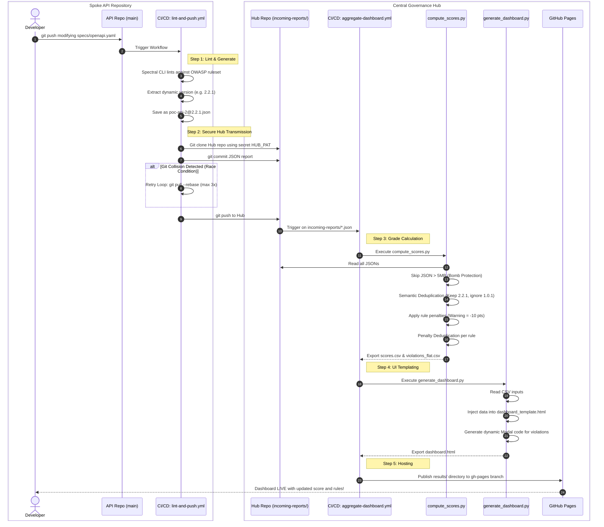

# Architecture, Processes & Execution Flow

This document is the definitive technical guide on how code, scripts, and CI/CD pipelines interact across the Governance Hub to calculate and display scores.

## Sequence Diagram: The Data Journey



---

## 1. The API Pipeline (`poc-api-N`)
**Location:** API Repository (`poc-api-1`, `poc-api-2`...)  
**Trigger:** Developer pushes a commit that modifies `specs/**/*.yaml`  
**Pipeline File:** `.github/workflows/lint-and-push.yml`

This pipeline acts as the **agent**. It executes Spectral locally, extracts metadata, and pushes the payload to the Central Hub.

### **Code Execution Steps:**
1. **Linting Analysis**
   ```bash
   spectral lint specs/openapi.yaml -r url-to-owasp23-ruleset -f json -o spectral-results.json
   ```
2. **Version Extraction (Dynamic Naming)**
   The CI script extracts `info.version` from the swagger file (e.g., `2.2.1`).
   It renames the payload: `mv spectral-results.json poc-api-[NAME]@[VERSION].json`.
3. **Payload Transmission (Collision Resilient)**
   The CI clones the **Hub Repository** using a secret `HUB_PAT`.
   It copies the JSON into `incoming-reports/` and commits.
   To prevent Git failures when dozens of APIs push simultaneously, it uses a resilience loop:
   ```bash
   until git push origin main; do
       git pull --rebase origin main
       sleep 2
   done
   ```

---

## 2. The Hub Aggregation Pipeline
**Location:** Hub Repository (`central-hub-gouv-poc`)  
**Trigger:** A new JSON file is pushed to `incoming-reports/*.json`  
**Pipeline File:** `.github/workflows/aggregate-dashboard.yml`

This pipeline acts as the **brain**. It recalculates all global metrics and generates a static website.

### **Code Execution Steps:**

#### Step A: Data Processing (`compute_scores.py`)
**Input:** `incoming-reports/*.json`
**Output:** `results/scores.csv` & `results/violations_flat.csv`

1. The script loops over all JSON files in `incoming-reports/`.
2. **JSON Bomb Protection**: Files > 5MB are immediately skipped.
3. **Semantic Version Deduplication**:
   If the script finds `poc-api-2@1.0.1.json` AND `poc-api-2@2.2.1.json`, it mathematically compares the arrays `[1,0,1]` vs `[2,2,1]`. It completely **ignores** the older `1.0.1` payload to prevent branch regressions from downranking the dashboard.
4. **Volume Deduplication (Scoring Mechanics)**:
   It parses `rulesets/owasp23-ruleset.spectral.yml` configurations (e.g., Warning = -10).
   If a single rule like `owasp:api4:2023-string-limit` occurs **260 times**, it is counted as a single failure. The score is only penalized by `-10` once.

#### Step B: Front-End Compilation (`generate_dashboard.py`)
**Input:** `results/scores.csv`, `results/violations_flat.csv`, `templates/dashboard_template.html`
**Output:** `results/dashboard.html`

1. This script contains ZERO scoring logic. It strictly acts as a templating engine.
2. It parses the CSV tables generated by Step A.
3. It iterates over the base HTML `dashboard_template.html`.
4. It injects color codes (Grade A = Green, E = Red).
5. It dynamically generates the HTML **Modals** (the hidden popup tables that appear when you click an API line) using the `violations_flat.csv` dataset.

#### Step C: Host Deployment
**Action:** `peaceiris/actions-gh-pages@v4`
Instead of committing the massive generated HTML back to the `main` branch (which would ruin the Git history), this action force-pushes the exact contents of the `results/` folder directly to the `gh-pages` orphaned branch. GitHub Pages instantly picks this up and serves the Dashboard live to users.
