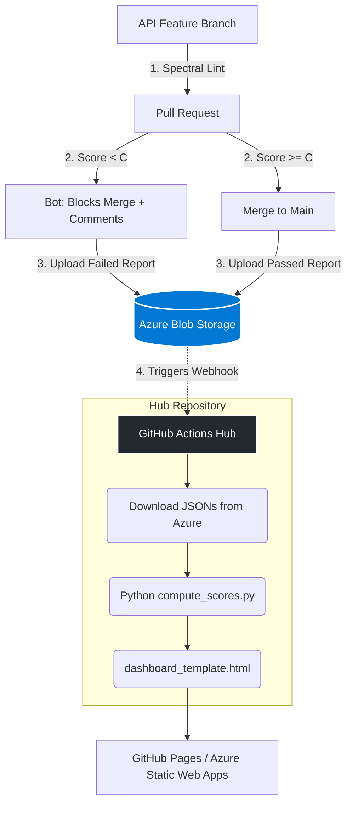

# 🛡️ Central API Governance Hub

[](https://github.com/azammel-reply/central-hub-gouv-poc/actions/workflows/aggregate-dashboard.yml)
[](https://azammel-reply.github.io/central-hub-gouv-poc/dashboard.html)

> Central governance hub that collects API linting results from multiple repositories, scores them against the OWASP API Security Top 10 2023 ruleset, and publishes an automated compliance dashboard.

## Architecture

```
┌──────────────┐     ┌──────────────┐     ┌──────────────┐
│  poc-api-1   │     │  poc-api-2   │     │  api-xxx-N   │
│  (Grade A)   │     │  (Grade E)   │     │  (Grade ?)   │
└──────┬───────┘     └──────┬───────┘     └──────┬───────┘
       │                    │                    │
       └────── push JSON ───┼──── push JSON ─────┘
                            ▼
              ┌──────────────────────────┐
              │   central-hub-gouv-poc   │
              │                          │
              │  incoming-reports/*.json  │  ← raw Spectral results
              │  scripts/scoring_rules.py │  ← scoring config
              │  scripts/compute_scores.py│  ← scoring engine
              │  templates/dashboard_template.html │  ← HTML template
              │  scripts/generate_dashboard.py     │  ← dashboard generator
              │  rulesets/owasp23-*.yml   │  ← central ruleset
              └────────────┬─────────────┘
                           │ GitHub Actions
                           ▼
                 GitHub Pages Dashboard
          azammel-reply.github.io/central-hub-gouv-poc
```

## Enterprise-Grade Resilience

The Governance Hub and its downstream APIs implement advanced structural checks for high-scale enterprise scenarios:

- **Spoke API CI/CD Guardrails**: 
  - **Missing Spec Handling**: Custom `if/exit 0` guards to avoid failing pipelines when specs are moving or absent.
  - **Path-based Execution Filters**: Linting triggers strictly only on `specs/**` file changes.
  - **Checksum Optimization**: Diff comparison blocks redundant commits/pushes for unmodified APIs.
  - **Git Collision Resilience**: Up to 3x `git pull --rebase` exponential retrys against `non-fast-forward` merge blocks when dozens of APIs simultaneously push reports.
- **Hub Version Accumulation Management**:
  - `score_local.py` mathematically parses semantic version fragments (`1.10.0` vs `1.2.0`) from the incoming JSON filenames.
  - It automatically deduplicates and **retains only the latest absolute version** for any API. This guarantees Dashboard accuracy and prevents accumulating "garbage reports" over years.

## How It Works

1. **API repos** (poc-api-1, poc-api-2, ...) run Spectral against the central OWASP ruleset on every push to `main`.
2. Linting results (JSON) are pushed to `incoming-reports/` via a Governance Bot.
3. The **Aggregate Dashboard** workflow detects new/changed JSON files and:
   - Scores each API using a deduplicated penalty system
   - Generates CSV, JSON, and an interactive HTML dashboard
   - Deploys to GitHub Pages automatically

## Scoring Algorithm

| Severity | Penalty per distinct rule violated |
| -------- | ---------------------------------- |
| Error    | -20 pts                            |
| Warning  | -5 pts                             |
| Info     | -2 pts                             |
| Hint     | -1 pt                              |

**Grade Scale**: A (≥85) → B (≥70) → C (≥50) → D (≥30) → E (<30)

> A rule violated 100 times only penalises once — but occurrences are tracked for drill-down.

## Onboarding a New API

1. Create a new repository with your OpenAPI spec in `specs/openapi.yaml`.
2. Copy the workflow from [poc-api-1/.github/workflows/lint-and-push.yml](https://github.com/reply-fr/poc-api-1/blob/main/.github/workflows/lint-and-push.yml).
3. Add a GitHub secret `HUB_PAT` — a Personal Access Token with `repo` scope from the hub owner.
4. Push to `main` — the API will appear on the dashboard automatically!

## Project Structure

```
central-hub-gouv-poc/
├── .github/workflows/
│   └── aggregate-dashboard.yml    # CI/CD: score + deploy
├── scripts/
│   ├── scoring_rules.py           # Scoring configuration
│   ├── compute_scores.py          # Scoring engine
│   └── generate_dashboard.py      # Dashboard generator
├── templates/
│   └── dashboard_template.html    # HTML/CSS/JS template
├── incoming-reports/              # Raw Spectral JSON results
├── rulesets/
│   └── owasp23-ruleset.spectral.yml  # Central OWASP ruleset
├── results/                       # Generated output (CSV/JSON/HTML)
└── README.md
```

## Local Development

```bash
# Score the incoming reports
cd scripts
python compute_scores.py --results-dir ../incoming-reports --output-dir ../results

# Generate the dashboard
python generate_dashboard.py \
  --scores-file ../results/scores.csv \
  --violations-file ../results/violations_flat.csv \
  --output ../results/dashboard.html

# Open in browser
open ../results/dashboard.html
```

## Related Repositories

| Repository                                         | Grade | Description                       |
| -------------------------------------------------- | ----- | --------------------------------- |
| [poc-api-1](https://github.com/reply-fr/poc-api-1) | A     | Best-practice OWASP-compliant API |
| [poc-api-2](https://github.com/reply-fr/poc-api-2) | E     | Intentionally insecure API        |

---

## 🚀 Next Phase: Enterprise Industrialization (V2)

While the current POC architecture is highly resilient, heavily scaled organizations (e.g., 500+ APIs, 1000+ developers) require further industrialization. The following three pillars represent the target V2 architecture:

### 1. Stateless Hub (Azure Blob Storage)
**The limitation**: Thousands of APIs pushing continuous JSON reports will eventually cause Git history bloat and hit GitHub API rate limits. 
**The target**: Eliminate Git as a database and migrate the storage of raw `spectral-results.json` files into **Microsoft Azure Blob Storage**. 
- The Hub Git history remains pristine (0 data commits).
- Azure Blob Storage native lifecycle policies auto-delete JSONs older than 6 months.

### 2. Zero-Trust Security (GitHub App Registration)
**The limitation**: For POC simplicity, all API spoke pipelines share a static GitHub Personal Access Token (`HUB_PAT`) to authenticate and push to the Hub.
**The target**: Replace the PAT with a dedicated **GitHub App**. Each API repository will install the App and dynamically request a short-lived OAuth token strictly scoped to write to the storage layer, ensuring true zero-trust security and granular auditability.

### 3. Shift-Left (Pull Request Feedback)
**The limitation**: Currently, the central dashboard updates *after* code is merged to `main`, meaning non-compliant API designs are already in production.
**The target**: Integrate Spectral execution directly on feature branches during **Pull Requests**. If the score drops below an acceptable grade (e.g., below 'C'), the CI pipeline fails. Furthermore, a Git bot automatically posts a comment on the PR detailing the exact OWASP violations to fix *before* the branch can be merged.

### Target Architecture Diagram (Phase 2)



### 4. Universal CI/CD Compatibility (GitLab, Azure DevOps, Bitbucket)
**The limitation**: Cross-platform CIs currently have to execute Git clone/commit/push commands to GitHub just to transmit their JSON results, which feels unnatural.
**The target**: Transitioning to Azure Blob Storage (V2) actually makes universal compatibility **easier**. 
- Whether an API is hosted on **GitLab**, **Azure Repos**, or **Bitbucket**, its CI pipeline simply runs `spectral lint` and uses the universal Azure CLI (`az storage blob upload`) or an HTTP curl request with a SAS Token to send its JSON to the bucket.
- No cross-platform Git authentication is required. The Azure Storage becomes the ultimate agnostic data lake.

### 5. Architect Recommendations for V2 Robustness
Depending on specific organizational constraints, the following capabilities should be integrated into the V2 roadmap:

- **Event-Driven Triggers**: Without Git commits on the Hub, the dashboard compilation should rely on an **Azure Event Grid Webhook** configured on the Blob Storage. This triggers the GitHub Actions reporting workflow *only* when a new JSON payload arrives, avoiding costly polling.
- **Reporting Glass Ceiling**: The static Python HTML generator (`generate_dashboard.py`) will eventually saturate the client's web browser DOM when rendering the violation history of 1000+ APIs. Transition the Python script from generating HTML to pushing aggregated scoring metrics directly into a dedicated enterprise BI workspace (**PowerBI, Grafana, or Azure Log Analytics**).
